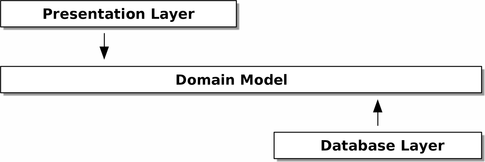

### Proposed Solution

Current Strategy:

- Python 3.13:
        - As I currently use Python for most of my projects and it is a versatile language for backend development.
        - Current LTS version.

- Framework:
        - FastAPI:
            - great for building APIs quickly and efficiently.
            - supports asynchronous programming out of the box.
            - has automatic generation of OpenAPI documentation.

- Data Persistence Layer:
        - Repository abstraction layer for data access:
            - In-memory caching for improved performance
            - Custom JSON/CSV file-based storage

- Deployment:
        - Docker for containerization
        - Kubernetes for orchestration

- CI/CD:
        - Github CI/CD:
        - Code Quality checks:
            - use pre-commit hooks (to simplify the process of maintaining code quality)
            - Runs for each MR/RP for the development and main branches
        - Coverage checks:
            - Minimum 80% coverage required to merge a PR

- Git Workflow:
      - Branches:
        - main for production-ready code
        - development for the latest development changes
        - feature branches based on development for new features or bug fixes
      - Merging:
        - PRs/MRs to merge feature branches into development
        - PRs/MRs to merge development into main
        - All PRs/MRs require at least one approval and successful CI/CD checks

- Code Quality:
        - Pre-commit for pre-commit hooks to ensure code quality
            - ruff for linting and formatting
            - Bandit for vulnerability scanning

- Testing:
        - pytest for unit and integration tests
        - TDD with BDD for behavior-driven development

- Linting:
        - ruff for code quality and consistency

- Documentation:
        - Served automatically with FastAPI's built-in OpenAPI support
        - Additional documentation in the README.md file

- Documentation/Testing:
        - BDD development with pytest-bdd
            - Serves as roadmap for development
            - Serves as documentation for other developers
            - Works really well with GenAI tools
                - General framework for the feature as guideline
                - Faster diagrams with MermaidJS

- Diagrams:
        - MermaidJS for diagrams based on the feature files

- Dependency Management:
        - UV for managing dependencies, virtual environments, and python versions

- Modeling:
        - DDD for domain-driven design (mostly using Cosmic Python guidelines)
            - clear separation of concerns
            - easier to maintain and scale the application

- GenAI Tools:
        - Copilot:
            - for code suggestions and autocompletion
        - Gemini:
            - for code suggestions, design suggestions and for brainstorming

### Why This Architecture?
The architecture is designed to be modular, scalable, and maintainable.

The project follows the Onion Architecture to ensure loose coupling and high cohesion. The core domain logic is at the center, independent of any external frameworks or infrastructure. This separation of concerns makes the system more maintainable, testable, and scalable.

Dependencies point inwards, from the outer layers (like entrypoints and infrastructure) to the inner layers (service layer and domain). This prevents the core business logic from being coupled to implementation details.

The idea is that when we start with a solid foundation, referencing the domain model, we get for free a domain that is clear from infrastructure concerns, making it easier to test and maintain.

We separate on service layer, which contains the business logic, from the entrypoints (FastAPI) and infrastructure (data persistence).

We implemented a repository pattern to abstract the data access layer, allowing for easy swapping of data storage mechanisms (in-memory, file-based, database, etc.) without affecting the core business logic.

We use a unit of work pattern to manage transactions and ensure data consistency across multiple operations.
This would allow for multiple replicas of this same service to run in parallel, behind a load balancer, if needed.

We use Behavior driven design intentionally because feature files use gherkin syntax, a human-readable format, to drive the development process, as it is intertwined with both tests and implementation.

This ensures that the implementation aligns with the specified requirements, and allows other developers if there ever were to be, to hop onboard, understand the behavior of the system quickly and start coding.

The use of pre-commit hooks and CI/CD pipelines ensures that code quality is maintained throughout the development process.

### Why This Stack?".
I intentionally chose a production-grade stack not because the problem's complexity demanded it, but to demonstrate your proficiency with the tools and practices used to build scalable, maintainable, and robust systems like those at Mercado Libre.
